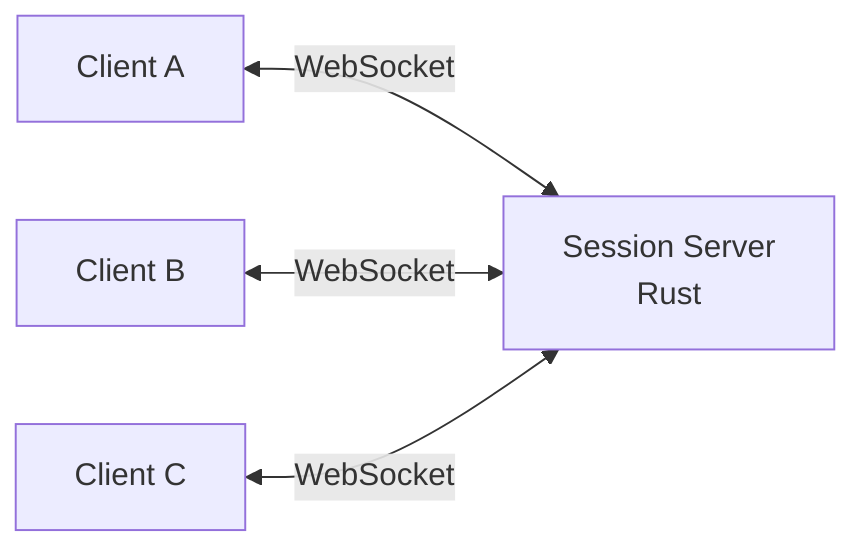

## What is OpenWatchParty?

**OpenWatchParty** is a Jellyfin plugin that enables synchronized media playback across multiple clients. Watch movies and shows together with friends, no matter where they are.

Unlike Jellyfin's built-in SyncPlay, OpenWatchParty uses a dedicated external session server, providing more reliable synchronization and better latency handling.

## Architecture

The system consists of three components:

| Component | Technology | Role |
|-----------|------------|------|
| **Jellyfin Plugin** | C# | Delivers client JavaScript and configuration UI |
| **Session Server** | Rust | Manages rooms, relays sync messages via WebSocket |
| **Web Client** | JavaScript | Embedded in Jellyfin UI, coordinates playback |



## Features

- **Real-time Synchronization**: Playback stays in sync across all participants
- **Room-based Management**: Create and join watch party rooms
- **Host Control**: The party creator controls playback (play, pause, seek)
- **Latency Monitoring**: RTT (Round-Trip Time) measurement and display
- **Drift Correction**: Automatic playback rate adjustment to maintain sync
- **HLS Support**: Works with transcoded content via HTTP Live Streaming
- **JWT Authentication**: Secure user identity verification

## Installation

### 1. Deploy the Session Server

```bash
docker run -d \
  -p 3000:3000 \
  -e ALLOWED_ORIGINS=https://your-jellyfin-domain.com \
  ghcr.io/mhbxyz/openwatchparty-session-server:latest
```

### 2. Add the Plugin Repository

In Jellyfin Dashboard:
1. Go to **Dashboard** > **Plugins** > **Repositories**
2. Add the OpenWatchParty repository URL
3. Install the plugin from the Catalog

### 3. Enable the Client Script

In Jellyfin Dashboard:
1. Go to **Dashboard** > **General**
2. Add the custom HTML script to enable the client

## How It Works

1. **Clock Synchronization**: Clients sync their clocks with the session server using Exponential Moving Average (EMA) smoothing
2. **Room Creation**: The host creates a room and shares the room code
3. **Participants Join**: Others join using the room code
4. **Playback Events**: When the host plays, pauses, or seeks, the action is broadcast to all participants
5. **Drift Detection**: If a client drifts out of sync, playback rate is adjusted to catch up

## Development

```bash
# Clone the repository
git clone https://github.com/mhbxyz/OpenWatchParty.git
cd OpenWatchParty

# Start development environment
make up

# Run in dev mode
make dev

# Watch for changes
make watch
```

## Resources

- **Documentation**: https://mhbxyz.github.io/OpenWatchParty/
- **GitHub**: https://github.com/mhbxyz/OpenWatchParty
- **License**: MIT
