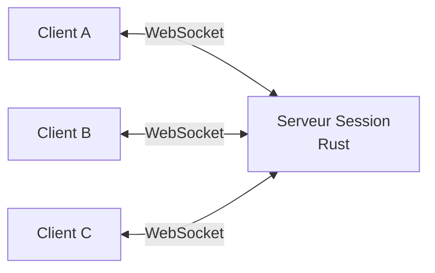

## Qu'est-ce qu'OpenWatchParty ?

**OpenWatchParty** est un plugin Jellyfin qui permet la lecture synchronisée de médias sur plusieurs clients. Regardez des films et séries avec vos amis, peu importe où ils se trouvent.

Contrairement au SyncPlay intégré de Jellyfin, OpenWatchParty utilise un serveur de session externe dédié, offrant une synchronisation plus fiable et une meilleure gestion de la latence.

## Architecture

Le système se compose de trois composants :

| Composant | Technologie | Rôle |
|-----------|-------------|------|
| **Plugin Jellyfin** | C# | Fournit le JavaScript client et l'interface de config |
| **Serveur de Session** | Rust | Gère les salons, relaie les messages via WebSocket |
| **Client Web** | JavaScript | Intégré à l'UI Jellyfin, coordonne la lecture |



## Fonctionnalités

- **Synchronisation Temps Réel** : La lecture reste synchronisée entre tous les participants
- **Gestion par Salons** : Créez et rejoignez des salons de visionnage
- **Contrôle par l'Hôte** : Le créateur contrôle la lecture (play, pause, seek)
- **Monitoring de Latence** : Mesure et affichage du RTT (Round-Trip Time)
- **Correction de Dérive** : Ajustement automatique de la vitesse pour maintenir la sync
- **Support HLS** : Fonctionne avec le contenu transcodé via HTTP Live Streaming
- **Authentification JWT** : Vérification sécurisée de l'identité des utilisateurs

## Installation

### 1. Déployer le Serveur de Session

```bash
docker run -d \
  -p 3000:3000 \
  -e ALLOWED_ORIGINS=https://votre-domaine-jellyfin.com \
  ghcr.io/mhbxyz/openwatchparty-session-server:latest
```

### 2. Ajouter le Dépôt de Plugins

Dans le Dashboard Jellyfin :
1. Aller dans **Dashboard** > **Plugins** > **Repositories**
2. Ajouter l'URL du dépôt OpenWatchParty
3. Installer le plugin depuis le Catalogue

### 3. Activer le Script Client

Dans le Dashboard Jellyfin :
1. Aller dans **Dashboard** > **Général**
2. Ajouter le script HTML personnalisé pour activer le client

## Comment ça fonctionne

1. **Synchronisation d'Horloge** : Les clients synchronisent leurs horloges avec le serveur via EMA (Exponential Moving Average)
2. **Création de Salon** : L'hôte crée un salon et partage le code
3. **Les Participants Rejoignent** : Les autres rejoignent avec le code du salon
4. **Événements de Lecture** : Quand l'hôte joue, pause ou navigue, l'action est diffusée à tous
5. **Détection de Dérive** : Si un client se désynchronise, la vitesse de lecture s'ajuste pour rattraper

## Développement

```bash
# Cloner le dépôt
git clone https://github.com/mhbxyz/OpenWatchParty.git
cd OpenWatchParty

# Démarrer l'environnement de dev
make up

# Lancer en mode dev
make dev

# Surveiller les changements
make watch
```

## Ressources

- **Documentation** : https://mhbxyz.github.io/OpenWatchParty/
- **GitHub** : https://github.com/mhbxyz/OpenWatchParty
- **Licence** : MIT
